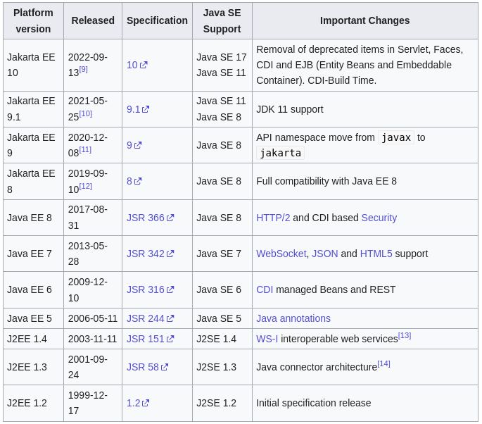
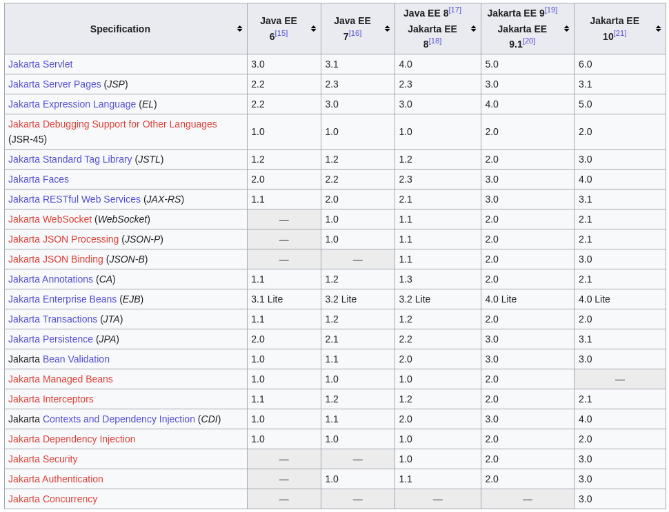
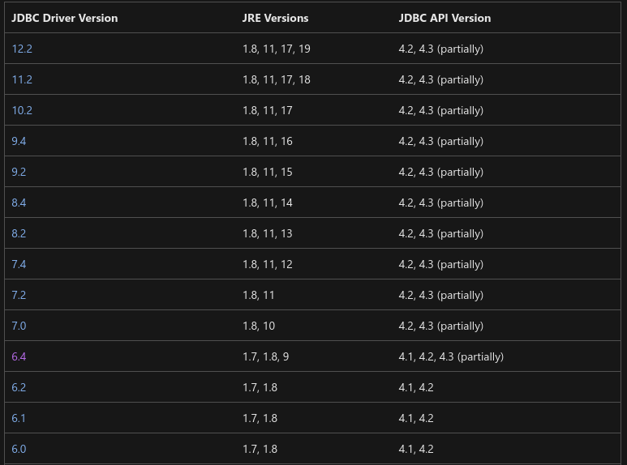

= Versions
:stylesheet: ../../shared/adoc-styles.css
:toc:
:toclevels: 5

{empty} +

===  🦋 -> ⛵

* 8-13 -> 7
* 14-26 -> 8
* 27+ ->10

{empty} +

===  🦋 -> provided modules

* Special resolution paths:
** JEE
*** `javaee.api` -alias for-> `wildfly.api` -> has deps -> `javax.*`
* How to look up:
** start `docker`, go to `modules`, copy `jar`, read contents of `META-INF/../pom.xml`

|===
| 🦋                  | 8     | 14     | 26.1.2
| `opensaml`            |       |       | `3.4.6`
| `javax/faces/api`       |       |   | `org.jboss.spec.javax.faces` `jboss-jsf-api_2.3_spec` `3.1.0.SP01`
| `javax/servlet/api`   |       |       | `org.jboss.spec.javax.servlet` `jboss-servlet-api_4.0_spec` `2.0.0.Final`
|===

{empty} +

https://en.wikipedia.org/wiki/Jakarta_EE

{empty} +

=== history

=== web

=== mssql

