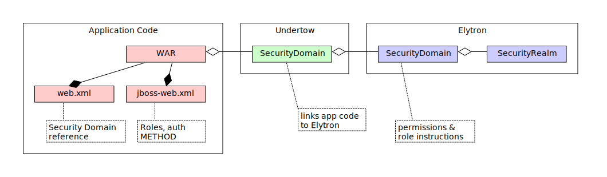
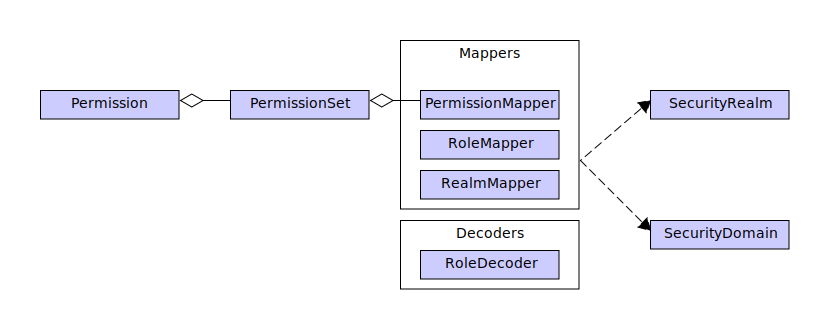

= Elytron
:stylesheet: ../../styles.css
:toc:
:toclevels: 5

* Elytron has SecurityRealms and SecurityDomains

== SecurityRealm

* _SecurityRealm_ maps
** from _Users_ / _Groups_
** to _Principal_ (e.g. ID)
* different types exist:
** `<properties-realm>` : backed by .properties files
** `<jdbc-realm>` : backed by SQL DB
** other see https://docs.wildfly.org/25/WildFly_Elytron_Security.html#realms[Elytron-Doc#realms]

=== SecurityDomain

* references 1..n _SecurityRealms_ via _mappers_.
** each referenced _SecurityRealm_ via `role-decoder` or `role-mapper`

=== Mappers

mappers enricht the Principal with Roles / Permissions etc.

{empty} +

== PermissionMapper

